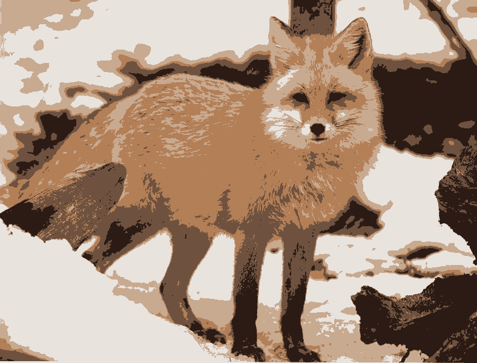
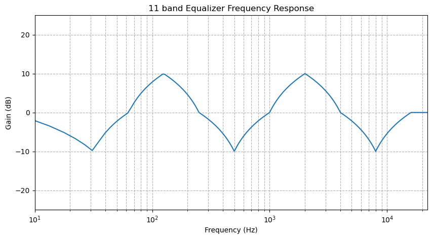
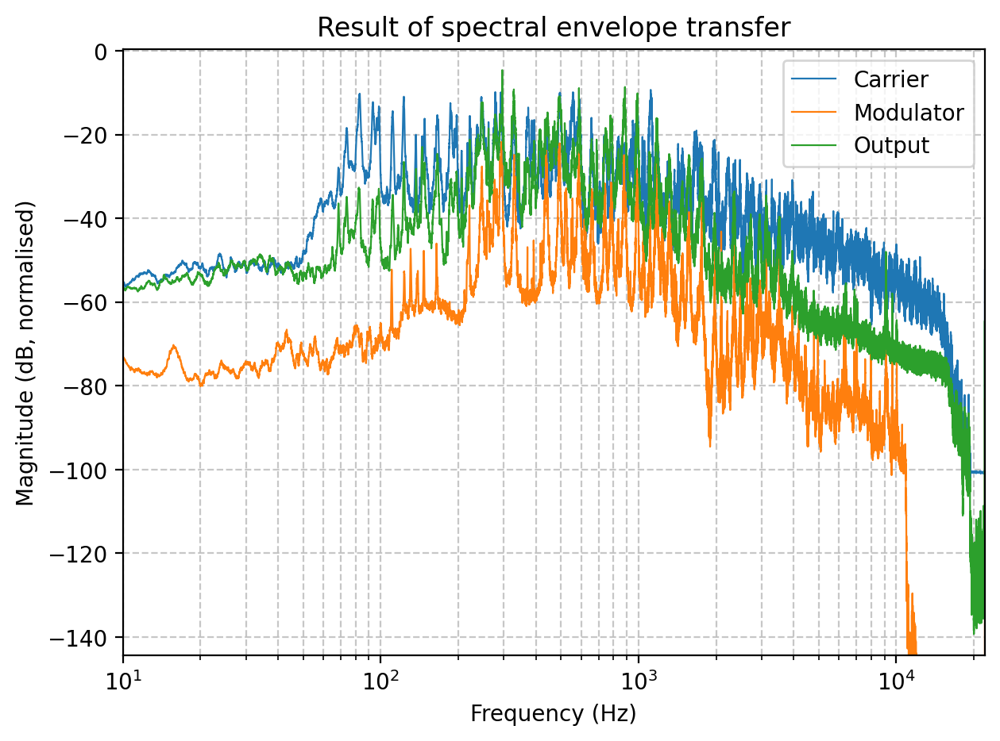

# Digital Signal Processing in Python

A collection of Python functions for audio and image processing.
Full documentation can be found in the docstrings within each Python file.
---

## Project contents

```
segment.py        # Image segmentation with Canny edge detection
image_ext.py      # Gradient-weighted spatial K-means segmentation
equaliser.py      # 11-band frequency-domain audio equaliser
audio_ext.py      # Spectral envelope transfer (cross-synthesis)
```

---


### `segment.py` — Edge-Based Image Segmentation

Segments an image into foreground and background using a custom Canny edge detection pipeline, optimised for natural scenes.
> **Assumption:** The background is connected to the top image border — typical for landscapes and objects in nature.

**Segmentation pipeline:**
1. **High-pass filtering** in the frequency domain to suppress lighting gradients
2. **Sobel gradient** compute edge magnitude and direction with 5×5 kernels
3. **Non-maximum suppression** to thin edges to one pixel
4. **Hysteresis thresholding** with BFS to connect weak edges to strong edges
5. **Morphological closing** to bridge gaps in edge boundaries
6. **Flood fill** from the top border to identify background

**Usage:**
```bash
python segment.py -i input.jpg -o mask.png -v visual.png
python segment.py -i input.jpg -o mask.png -v visual.png -c 0.1 -s 2.0 -l 75 -u 85 -k 5
```

**Arguments:**

| Flag | Description | Default |
|------|-------------|---------|
| `-i` | Input image file | Required |
| `-o` | Output mask image | `mask.png` |
| `-v` | Visual output (colour foreground, grey background) | `visual.png` |
| `-c` | High-pass filter cutoff frequency | `0.05` |
| `-s` | High-pass filter sigma multiplier | `4.0` |
| `-l` | Lower percentile threshold (weak edges) | `80` |
| `-u` | Upper percentile threshold (strong edges) | `95` |
| `-k` | Morphological closing kernel size (must be odd) | `3` |

**Example segmentation**

Input image:


Output mask:


Output visual:


---

### `cluster.py` — Gradient-Weighted Spatial K-Means Segmentation

Extends `segment.py` with multi-class segmentation using a custom K-means algorithm that incorporates both spatial proximity and gradient magnitude weighting.

**How it works:**
- Pixels are represented as 5D feature vectors: `[R, G, B, x_norm, y_norm]`
- Spatial coordinates encourage coherent, compact regions
- Cluster centroids are computed as **gradient-weighted means**, so edge pixels contribute more, aligning cluster boundaries with actual object borders
- Multiple random initialisations are run and the best result (clusters with lowest inertia) is kept

**Usage:**
```bash
python cluster.py -i input.jpg -o clusters.png
python cluster.py -i input.jpg -o clusters.png -k 10 -sw 2.5 -c 0.03 -t 100
```

**Arguments:**

| Flag | Description | Default |
|------|-------------|---------|
| `-i` | Input image file | Required |
| `-o` | Output clustered image | `output.png` |
| `-k` | Number of clusters | `5` |
| `-m` | Max K-means iterations | `100` |
| `-t` | Number of random trials | `5` |
| `-sw` | Spatial weight factor | `5.0` |
| `-c` | High-pass filter cutoff frequency | `0.05` |
| `-s` | High-pass filter sigma multiplier | `4.0` |

**Example clustering**

Input image:


Clustered output:


---

### `equaliser.py` — 11-Band Audio Equaliser

A frequency-domain equaliser with 11 fixed octave bands covering the full audible range.

**Band centre frequencies (Hz):** `6, 31.5, 63, 125, 250, 500, 1000, 2000, 4000, 8000, 16000`

**How it works:**
- Splits the audio into overlapping frames with Hann windowing
- Applies a gain mask in the frequency domain with Fast Fourier Transform (FFT)
- Reconstructs the signal using overlap-add

**Usage:**
```bash
python equaliser.py -i input.wav -o output.wav -b "0,-1,0,0,-3,0,0,3,0,0,2"
python equaliser.py -i input.wav -o output.wav -b "0,0,0,0,0,0,0,0,0,0,0" -p response.png
python equaliser.py -i input.wav -o output.wav -b "0,-3,0,3,0,-3,0,3,0,-3,0" -p plot.png -f 4096 -ov 8
```

**Arguments:**

| Flag | Description | Default |
|------|-------------|---------|
| `-i` | Input audio file path | Required |
| `-o` | Output audio file path | `output.wav` |
| `-b` | 11 comma-separated dB gains | Required |
| `-p` | Save frequency response plot | None |
| `-f` | FFT frame size | `8192` |
| `-ov` | Overlap factor | `4` (75% overlap) |

**Example frequency response plot for gains [0,-10,0,10,0,-10,0,10,0,-10,0]**



---

### `cross_synthesis.py` — Spectral Envelope Transfer (Cross-Synthesis)

Transfers the spectral envelope (timbre/formants) from a **modulator** signal onto a **carrier** signal, preserving the carrier's pitch and rhythm.
Signals with differing sample rates are automatically resampled. The shorter signal is looped to match the longer one.

**How it works:**
1. Both signals are split into overlapping frames
2. For each frame: FFT is computed for both signals
3. The modulator's spectral envelope is extracted with **cepstral liftering**
4. The carrier's excitation is isolated by dividing out its own envelope
5. Modulator envelope × carrier excitation are recombined with the carrier's phase
6. Inverse FFT and overlap-add reconstruction

**Best results:**
- **Carrier:** harmonically rich signal (e.g. piano, guitar, violin)
- **Modulator:** signal with a clear, slowly-varying envelope (e.g. voice)

**Usage:**
```bash
python cross_synthesis.py -c carrier.wav -m modulator.wav -o output.wav
python cross_synthesis.py -c violin.wav -m vocals.wav -o crossed.wav -p plot.png --lifter 150 --mix 0.7
```

**Arguments:**

| Flag | Description | Default |
|------|-------------|---------|
| `-c` | Carrier audio file | Required |
| `-m` | Modulator audio file | Required |
| `-o` | Output audio file | `output.wav` |
| `-p` | Save spectral comparison plot | None |
| `-l` | Lifter (quefrency cutoff) | `500` |
| `-mi` | Mix ratio (0 = dry, 1 = full transfer) | `1.0` |
| `-f` | FFT frame size | `8192` |
| `-ov` | Overlap factor | `4` |

**Example spectra plot**



---

## Dependencies

Install required packages with:

```bash
pip install numpy soundfile scipy matplotlib pillow
```

| Package | Used in |
|---------|---------|
| `numpy` | All modules |
| `soundfile` | `equaliser.py`, `cross_synthesis.py` |
| `scipy` | `cross_synthesis.py`, `segment.py`, `cluster.py` |
| `matplotlib` | `equaliser.py` (plotting), `cross_synthesis.py` (plotting) |
| `pillow` | `segment.py`, `cluster.py` |

---

## Author

Leonidas Papadakis
